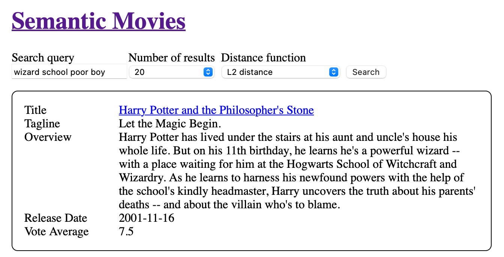

<figure>
    
    <figcaption>
        <small>If you want to go straight to demo: <a href="https://movies.6nok.org">https://movies.6nok.org</a></small>
    </figcaption>
</figure>


## Background

If you are having trouble keeping up with recent developments in AI, you're not alone. So many things are happening so quickly at the same time, it's easy to miss how cool each individual innovation is. One of them I want to talk about today is *vector embeddings*. [^1]

When you're chatting with a chatbot, it must translate the message that you wrote in your natural language to a language that it understands; a long series of numbers—or a vector. That's what AI researchers call "embedding". After the chatbot generates its answer—which is also a vector of numbers—it's translated back into words.

While not a new idea, its use is more widespread now thanks to a technique called *retrieval augmented generation*. But if we remove the generation part from the equation, it's still an impressive feat, retrieving documents that are relevant to the given user query. It could be applied to a problem that's been notoriously hard for a long time.

At a previous job, I was on the Search & Discovery team and we maintained an ElasticSearch cluster with a ton of configuration to achieve the best results. It was a bit like dark magic, which is why there's a 360 page book on how to achieve [relevant search](https://www.manning.com/books/relevant-search). Coincidentally, we had a tradition of doing monthly presentations about an interesting topic to teammates and one of the presentations was about [word2vec](https://en.wikipedia.org/wiki/Word2vec) (which is basically the OG vector embedding technique) and I found it very interesting.

I was interested in this idea for such a long time, but I didn't know where to start. I'm glad that vector embeddings have come such a long way that I was able to try and see how this technique fares against traditional techniques.

## Implementation

I wanted to implement the simplest thing that I could, and the current consensus is movies. Everyone is familiar with movies, has some favorites, and at some point in their lives searched for a movie they have seen while they were a child using natural language. It's the perfect fit. So I had to find a few thousand movies and their plot synopses.

After a few false starts, I stumbled upon [The Movies Dataset](https://www.kaggle.com/datasets/rounakbanik/the-movies-dataset?resource=download&select=movies_metadata.csv) on Kaggle, which includes 45,000 movies that go up until 2017, which was more than enough for me.

The next thing I needed was a database that would store the movies along with the embeddings for each movie; and offer a way to perform similarity search, which is the whole deal. I went for PostgreSQL, which is a tried and true database with a robust and popular vector embedding extension, [*pgvector*](https://github.com/pgvector/pgvector).

Since *pgvector* is agnostic to the vector embedding that you use, I also had to pick an embedding model. I wanted a cheap and fast model, so after a quick investigation, I settled on [*gte-small*](https://huggingface.co/Supabase/gte-small). With this last thing settled, I was ready to build the thing.

```javascript
import { pipeline } from "@xenova/transformers";
import { sql } from "slonik";

const generateEmbedding = await pipeline(
  "feature-extraction",
  "Supabase/gte-small"
);

// generate the embedding & create a sql fragment of vector type
export async function genEmbedding(texts) {
  const { data } = await generateEmbedding(texts, {
    pooling: "mean",
    normalize: true,
  });

  return sql.fragment`${sql.array(
    Array.from(data),
    sql.fragment`real[]`
  )}::vector`;
}
```

## Aside: Reproducibility

One thing I care a lot about is *reproducibility*. I want other people to be able to pull and experiment on my project without hitting any roadblocks, and I want to be able to return back to it a few years down the road with a brand new laptop and run it without a hitch.

So first of all, I added a script to the project that downloads the dataset from Kaggle using the official command line tool, which requires a free API key. I also added a seed script that parses the CSV and inserts the rows into the database while creating the embeddings.

But the most important thing that I did was to integrate [*devenv*](https://devenv.sh), a [Nix](https://blog.6nok.org/how-i-use-nix-on-macos/)-based project that pins every dependency and makes the project easily reproducible. [^2] As an added benefit, it can spawn the database and the dev server together, so it creates a friction-free development environment. But it's opt-in, if you spawn your own PostgreSQL instance, you can use npm scripts to start the project.

```nix
# simplified devenv config
{ pkgs, lib, config, inputs, ... }:
{
  # environment variables
  env = { POSTGRES_URL = "postgres://127.0.0.1/movies"; };

  # packages available in the development environment
  packages = [ pkgs.kaggle ];

  # enable javascript so nodejs and pnpm are available, and dependencies are installed
  languages.javascript = {
    enable = true;
    pnpm.install.enable = true;
  };

  # this declares postgres, its extensions, and initial databases
  services.postgres = {
    enable = true;
    extensions = extensions: [ extensions.pgvector ];
    initialDatabases = [
      {
        name = "movies";
        schema = ./migrations/0001_schema.sql;
      }
    ];
  };

  # when you run `devenv processes up` these will run
  processes.dev = {
    exec = "pnpm dev";
    process-compose.depends_on.postgres.condition = "process_healthy";
  };
}
```

## The application

The next thing I needed was a web application to query the database and see the results. For this, I used Next.js as that's what I'm familiar with, and I wanted to have a full-stack codebase that's highly integrated. I was also able to use newly released features like React Server Components [^3], `<style>` tag hoisting [^4], and `useFormStatus` [^5] hook.

```javascript
// an example component using modern React features
export function SubmitButton() {
  const { pending } = useFormStatus();
  return (
    <button type="submit" aria-busy={pending}>
      <style href="submit-button" precedence="default">{`
        button[type="submit"][aria-busy="true"] {
          opacity: 0.5;
        }
      `}</style>
      Search{pending ? "..." : ""}
    </button>
  );
}
```

I didn't want to use an ORM as I've grown disillusioned with them, so I used [Slonik](https://github.com/gajus/slonik), a PostgreSQL client that I've used in the past and enjoyed. It's integrated with [Zod](https://zod.dev) for validation for type-safety and I used Zod elsewhere in the project. I wanted to keep the project simple, so I put my dependencies on a diet and didn't add anything else.

The UI is also very simple, yet usable and accessible. I didn't go crazy with styling, just added visual cues and whitespace where necessary. The distance function selector was a nice addition thanks to an early suggestion. All in all, I'm happy with how it turned out.

## Deployment

Can you say you have built something if you don't deploy it? I didn't want to go into debt because of this, but I wanted to showcase it so I started looking for deployment options with free tiers that wouldn't be a lot of effort to cobble together.

Since I was already using Next.js, I went for Vercel, which is a perfect fit. Luckily Vercel has a first-party integration with [Supabase](https://supabase.com), which provides a free PostgreSQL database instance. Since I already consulted [their documentation](https://supabase.com/docs/guides/database/extensions/pgvector#storing-a-vector--embedding) about the *gte-small* embedding model, I was set.

I did most of the work from the Vercel dashboard, and when I had to access Supabase, there was a link to their dashboard, which didn't require a login. I had to enable *pgvector* there and a few more other things.

The most important thing I had to do was to set the environment variable `NODE_TLS_REJECT_UNAUTHORIZED=0` on Vercel, which was necessary for some reason, and I felt okay with it since I don't have any sensitive data.

```javascript
import { parse } from "csv-parse";
import fs from "fs/promises";
import { sql, createPool } from "slonik";

const pool = await createPool(process.env.POSTGRES_URL);

const csvFile = await fs.readFile("./movies_metadata.csv", "utf-8");

const parser = parse(csvFile, { columns: true });

// for each record, generate the embedding and insert into the database
for await (const record of parser) {
  const { imdbId, title, tagline, overview, releaseDate, voteAverage, genres } = record;
  const embedding = await genEmbedding([
  `
    Title: ${title}
    Tagline: ${tagline}
    Overview: ${overview}
    Release date: ${releaseDate}
    Genres: ${genres.join(", ")}
  `,
  ]);

  await pool.query(sql.typeAlias("void")`
    INSERT INTO movies (imdb_id, title, tagline, overview, release_date, vote_average, embedding)
    VALUES (${imdbId}, ${title}, ${tagline}, ${overview}, ${releaseDate}, ${voteAverage}, ${embedding});
  `);
}
```

## Performance

When I had the application running locally and seeded the database with embeddings, I started testing with some movies I thought of using natural language. Let me be frank, it didn't perform any miracles. Sometimes the movie I was thinking about would be in the top 10 results, sometimes not. But I'm not discouraged.

My theory about the quality of the results is two-fold: the embedding model that I used is tiny and I didn't provide a lot of data. Only the data that I found most important is included, increasing the amount of data makes the generation of the embedding vector slower. And the model is made to be fast and cheap. If I wanted to be more accurate, I would have to use a larger model, possibly from an AI vendor.

But there's some good too! It's somewhat typo-tolerant, unless the typo matches something else exactly. If you search for "old movies", you get some old movies, since I included the release date in the embedding. It's good enough for the money and effort it took to build and run it!

There's also the interesting; if you search for "virtual reality", you get [Oculus](https://www.imdb.com/title/tt2388715/), a horror movie by Mike Flanagan, in the top 20 results. The movie has no relation to VR whatsoever, but it's the name of a popular VR headset, which indicates the model has some sort of world knowledge.

```javascript
import { sql, createPool } from "slonik";

// get movies by embedding similarity to the query (L2 distance)
export async function getMovies(query, limit) {
  const embedding = await genEmbedding([query]);
  const movies = await pool.query(
    sql.type(Movie)`
    SELECT id, imdb_id, title, tagline, overview, release_date, vote_average
    FROM movies
    ORDER BY embedding <-> ${embedding}
    LIMIT ${limit};`
  );

  return movies.rows;
}
```

## Conclusion

I'm glad that I took on this project and I'm happy with the result. Maybe I was a bit underwhelmed with the results, but if I take a step back, it's still nothing short of magic! To get a somewhat workable search with so little effort for so cheap would have been unimaginable a few years ago.

But it's still important to acknowledge this isn't a silver bullet either. Traditional solutions like ElasticSearch still have their place, and if I needed a production-ready solution today, I would only use semantic search as a complementary technique.

In the future, I'd like to get my hands on a multimodal embedding model [^6] for images, so it's possible to search for what you want to see. I don't know if it would be a good fit for movies, but it would work great for e-commerce applications.

If you're interested, the source code is [open on GitHub](https://github.com/frontsideair/movies-pgvector-nextjs), feel free to tinker with it and let me know if anything's broken or if you found it useful!

[^1]: ["Embeddings are underrated"](https://technicalwriting.dev/embeddings/overview.html) is a great primer for vector embeddings.
[^2]: I mentioned *devenv* previously on my [post about using Nix on macOS](https://blog.6nok.org/how-i-use-nix-on-macos/#:~:text=with%20tools%20like-,devenv).
[^3]: https://react.dev/reference/rsc/server-components
[^4]: https://react.dev/reference/react-dom/components/style#special-rendering-behavior
[^5]: https://react.dev/reference/react-dom/hooks/useFormStatus
[^6]: [Nomic Embed Vision](https://www.nomic.ai/blog/posts/nomic-embed-vision) would be a good candidate.
