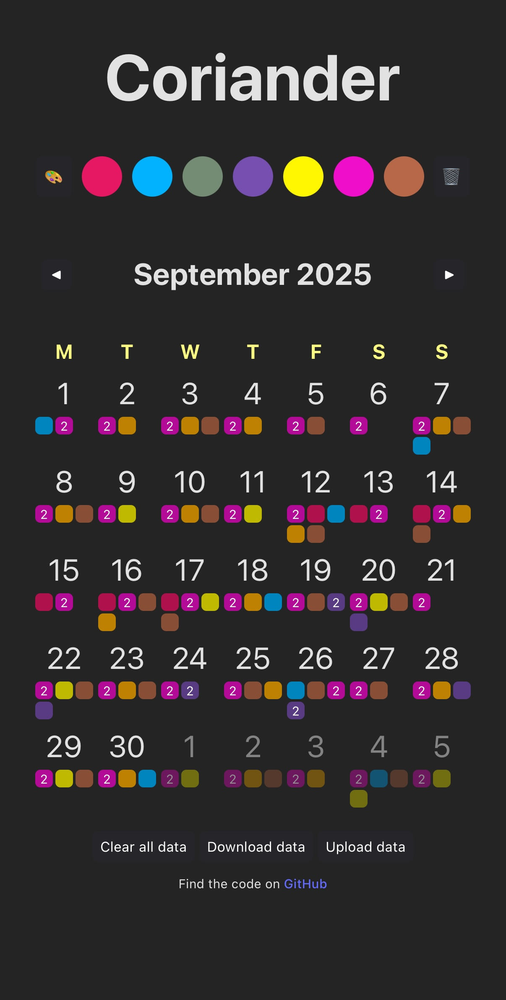
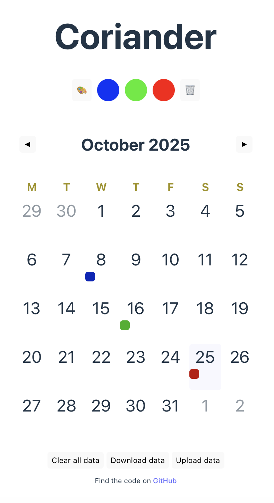

Let me talk about the most popular application I built. It's [Coriander](https://coriander.6nok.org), a daily tracker used by one person; my girlfriend. She loves it and has been using it daily for more than a year now. She's very happy with it.

| Dark mode                                                                                                                                       | Light mode                                                                        |
| ----------------------------------------------------------------------------------------------------------------------------------------------- | --------------------------------------------------------------------------------- |
|  |  |

She has been struggling with a chronic illness and needed a way to track her symptoms and medications. She came to me with this idea, and I built it in a day. She set the direction and chose all the features that went into it. It's very simple on purpose, does its job and doesn't get in the way.

She specifically asked for three things; tracking something should be as easy as one button press, it should be easy to review your history at a glance, and you should be able to track any number of things. Coriander checks all three boxes.

It looks great on mobile, doesn't require an account, and works offline. I don't update it often, and it doesn't break. I have no enshittification plans, and there's data export and import functionality. Her data survived when she upgraded her iPhone without doing anything. [^1]

I named it coriander because it's a color calendar. Colander could have been a better fit, but it felt too easy. She did a coriander logo for it.

There's no tracking, no bloat. 4 files are downloaded in total; the HTML, the JavaScript bundle, the stylesheet, and a webapp manifest for it to work offline.

It's accessible[^2], because I care, even though it'll be used by one person. I find it easier to start with accessibility in mind, by default, rather than try to bolt it on afterward.

She noticed today that she has been using it for such a long time. She wanted me to write about it. Here I am writing about it. It's not much, but it's useful and it's free for anyone to use. Give it a try, maybe?

[^1]: Good job Apple.
[^2]: Thanks to [React Aria Components](https://react-spectrum.adobe.com/react-aria/).
