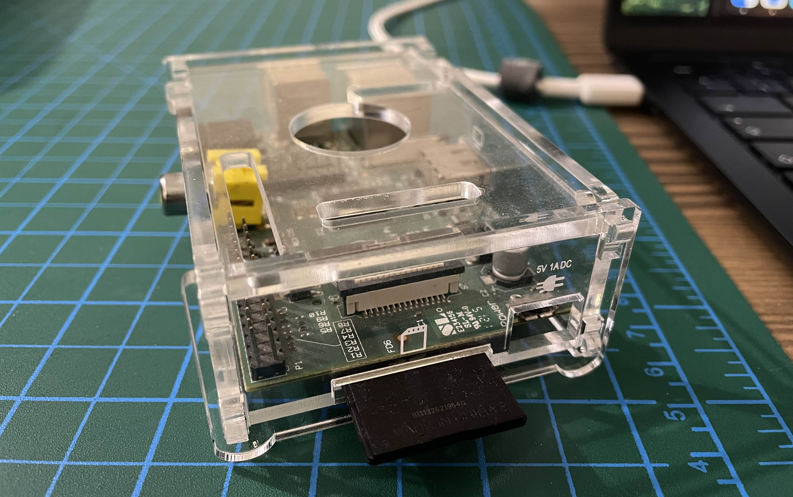

It's probably old news for most, but I've recently started using [Tailscale](https://tailscale.com) and wanted to share my experience with it.

I've heard of Tailscale many times before, but didn't get the appeal until recently. That happened when I started running a simple server from my trusty old Raspberry Pi version 1.

I know its local IP address and can `ssh` into it easily when I'm home, but when I'm outside, that's not possible as it's not exposed to the internet. For that reason, I have used DDNS[^1] in the past. The bad news is that it's no longer possible thanks to a cursed thing called CGNAT[^2]. I don't want to derail this post too much, but unfortunately port forwarding is no longer a thing that you can do. (And maybe it wasn't such a good idea to expose your home server to the internet to begin with.)

This reminded me of Tailscale, and I decided to give it a go. From what I could remember, it creates a virtual private network[^3] so you can access your devices anywhere with domain shorthands created by Tailscale.

Long story short, it worked! But it was too resource hungry for my old Raspberry Pi, so I ended up uninstalling it, and unrelatedly my pet project grew out and has its place in the cloud now.

You need to install the client software on the devices, which are mostly open-source[^4]. Then you need to log in with your account, which is an easy process. I won't go into detail about how to install and use it, since this isn't an ad, and such instructions can quickly go out-of-date.

Some additional and surprising benefits:
1. Exposing a port from your laptop to your phone: When developing a web application, once in a while you'll have to test on an actual device. (You do that, right?) The kind of thing you'd reach for [ngrok](https://ngrok.com) for. You can use the Tailscale-generated domain name (e.g. `http://my-macbook-air:3000`) to effortlessly connect to your development server.
2. [Taildrop](https://tailscale.com/kb/1106/taildrop): There's been a lot of times when I needed to move files from my Macbook to my Windows HTPC[^5], which is hard. I'd used [Snapdrop](https://snapdrop.net), which is excellent for the limitations it has to work around, but I was always on the lookout for a click-less solution. With Taildrop, you can drop files as easily as Airdrop, even when you're not in close proximity!
3. [Exit nodes](https://tailscale.com/kb/1103/exit-nodes): I clarified that Tailscale is a different kind of VPN, but I still need a VPN service from time to time, and I don't like having two clients for a similar job.[^6] With Tailscale, you can appoint a machine to be an exit node, ideally one in a VPS in a different country, so you can get comparable benefits to a VPN service.
4. [Mullvad exit nodes](https://tailscale.com/kb/1258/mullvad-exit-nodes): Related to the previous point, I know that VPN services allow you to exit from a large list of countries, and don't collect logs (if you believe them). With the [Mullvad partnership](https://mullvad.net/en/blog/tailscale-has-partnered-with-mullvad), Tailscale allows you to have the best of both worlds. And from what I can understand, it's essentially a two-tier VPN, like [iCloud Private Relay](https://support.apple.com/en-us/102602). Tailscale can't see your traffic, and Mullvad doesn't know who you are. If you're a privacy nerd, you may find this to be a good setup.

Disclaimer: I haven't yet tried exit nodes or Mullvad integration, so your actual experience may not turn out as I described.

I have used Tailscale only for personal reasons so far, using the free tier; they have enterprise plans for enterprise use cases that I have no idea about. I found it useful and wanted to share it in case it helps you too. I wasn't paid by them, and if you don't want to use their services for any reason, there's an open-source server implementation called [Headscale](https://headscale.net/), which works with their client software.

If you have more use cases, feel free to share them with me!

[^1]: Dynamic DNS: https://en.wikipedia.org/wiki/Dynamic_DNS
[^2]: Carrier-grade NAT: https://en.wikipedia.org/wiki/Carrier-grade_NAT
[^3]: Not to be confused with [VPN services](https://en.wikipedia.org/wiki/VPN_service) that are used for privacy and circumventing censorship
[^4]: CLI and daemon are open-source, wrappers for non open-source platforms are not: https://github.com/tailscale/tailscale#other-clients
[^5]: Home theater PC: https://en.wikipedia.org/wiki/Home_theater_PC
[^6]: And they don't work together so I have to disable one to enable the other.
